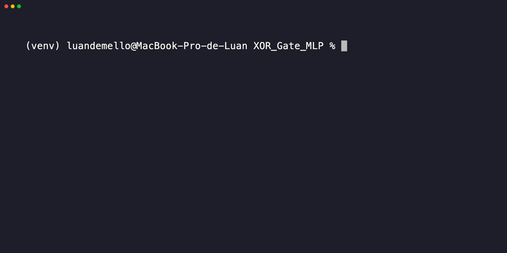

# XOR_Gate_MLP

Este projeto implementa uma rede neural usando para resolver o problema XOR.

## Instalação

1. Clone o repositório:
    ```sh
    git clone https://github.com/LuanRM1/XOR_Gate_MLP.git
    cd XOR_Gate_MLP
    ```

2. Crie um ambiente virtual e ative-o:
    ```sh
    python -m venv venv
    source venv/bin/activate  # No Windows use: venv\Scripts\activate
    ```

3. Instale as dependências:
    ```sh
    pip install torch
    pip install numpy
    ```

## Uso

1. Execute o script:
    ```sh
    python3 mlptorch.py
    python3 mlp.py
    ```

## Resultados


